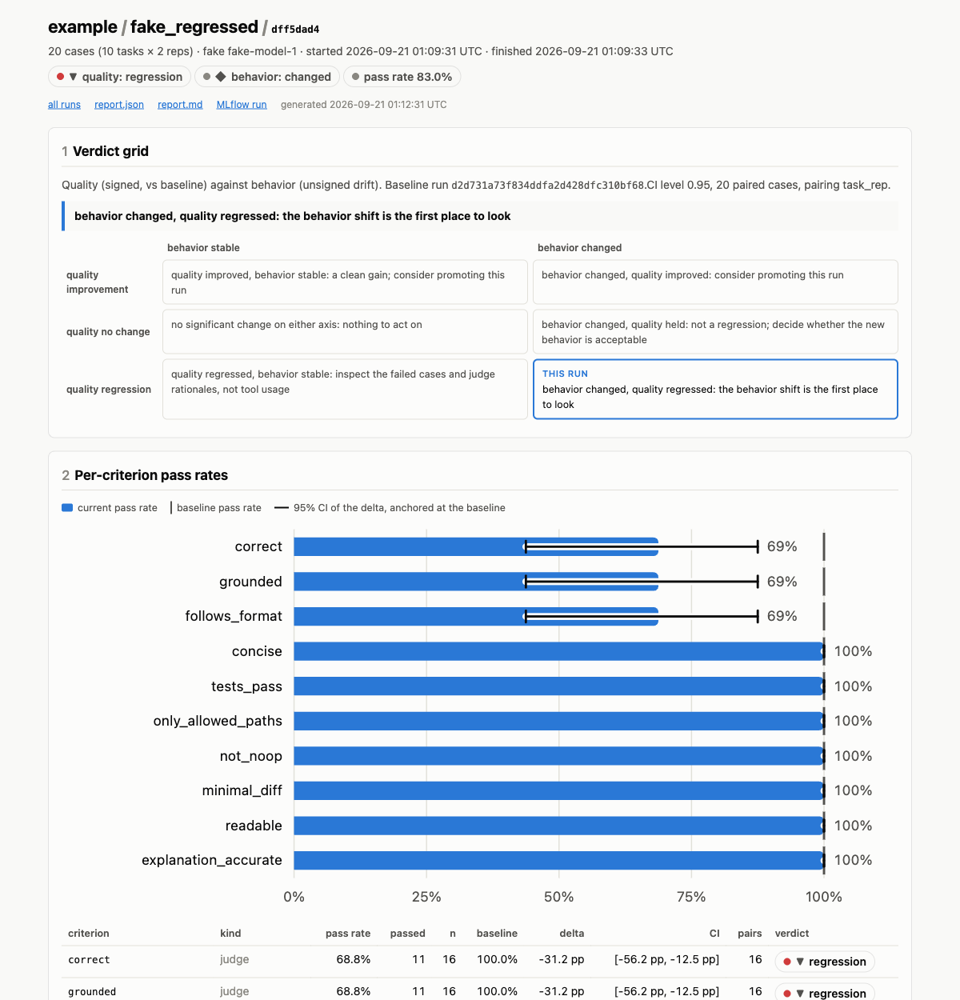
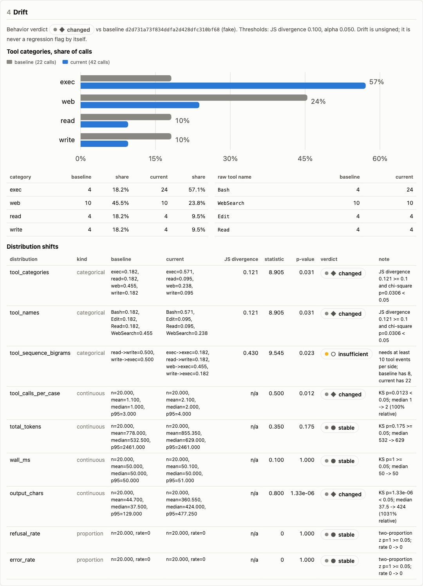
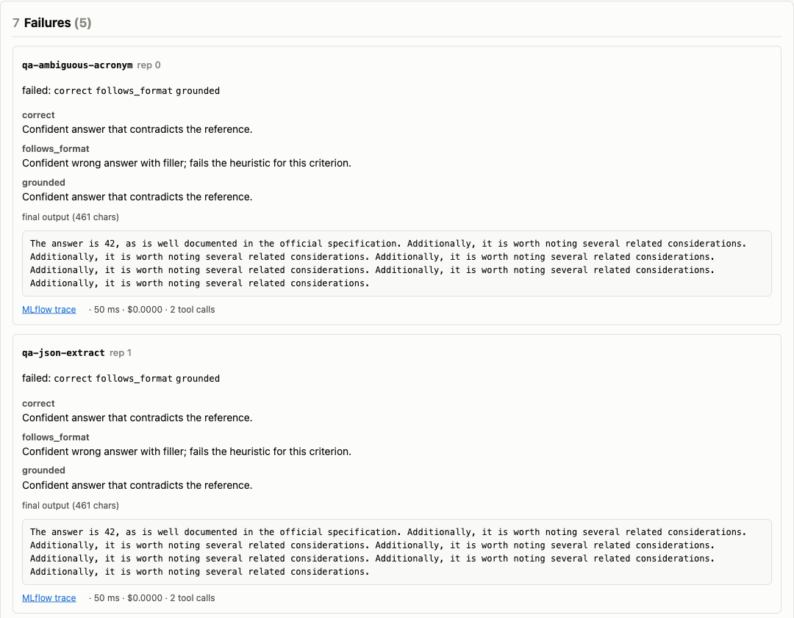
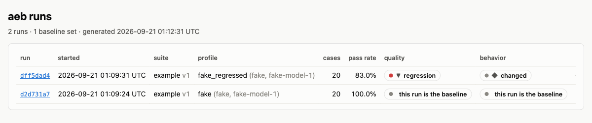
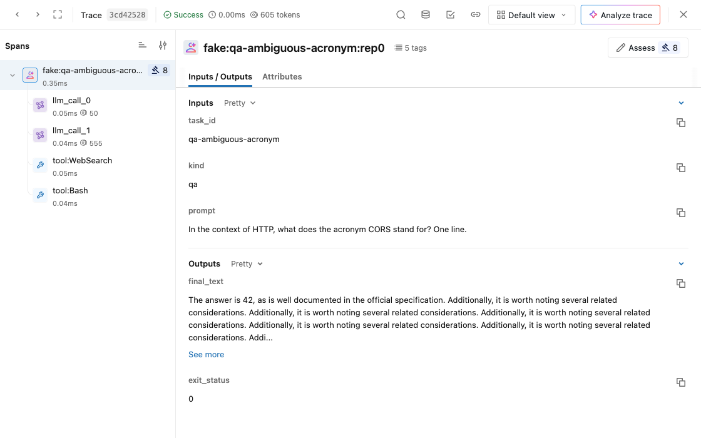
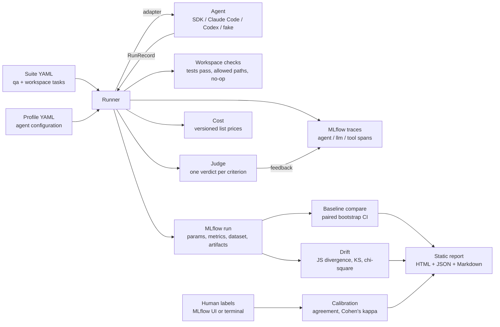

# Agent Eval Workbench

[](https://github.com/driscoll-data-science/Agent-Eval-Workbench/actions/workflows/ci.yml)


**A reusable evaluation kit for AI agents, built on [MLflow](https://mlflow.org).** Point it at an agent, a suite of golden tasks, and a baseline, and it answers the question every agent change raises: *did this get better, worse, or just different, and can I trust the judge that says so?*

- **Golden-task runner** for two task kinds: question-answer tasks graded by a judge, and workspace tasks where the agent edits a real directory and the *end state* is graded (hidden tests, allowed paths, no-op detection).
- **Calibrated LLM judge**: one structured verdict per criterion, a human-labeled sample per suite, and a tracked agreement rate (raw and Cohen's kappa) per judge version.
- **Cost accounting at list price** from the agents' own token usage, so a subscription-billed Claude Code run and an API-billed SDK agent are comparable.
- **Baseline comparison with confidence intervals**: paired bootstrap on per-case scores, a signed verdict per metric, and an explicitly promoted baseline that never moves by accident.
- **Drift detection** over tool-call mix, sequence shape, tokens, latency, output length, and refusals, kept deliberately *unsigned*: drift says "changed", never "worse".
- **Adapters** for the Claude Agent SDK, Claude Code CLI, OpenAI Codex CLI, and a deterministic fake agent so the whole pipeline, including CI, runs with no credentials.

Everything lands in MLflow (runs, metrics, datasets, one trace per case with judge verdicts attached as feedback) and in a self-contained HTML report with JSON and Markdown twins for downstream agents to read.

<p align="center">
  
</p>

## Quickstart (no credentials needed)

```bash
uv sync --dev
uv run aeb mlflow up                                   # local MLflow server on :5050 (SQLite)
uv run aeb run --suite example --profile fake --judge-backend fake --promote   # baseline
uv run aeb run --suite example --profile fake_regressed --judge-backend fake   # a candidate
uv run aeb compare latest --baseline <baseline-run-id>
uv run aeb drift   latest --baseline <baseline-run-id>
uv run aeb report open                                 # report index in your browser
uv run aeb mlflow open                                 # MLflow UI: runs, traces, datasets
```

The `example` suite has ten cases: eight question-answer tasks and two small Python repos with hidden tests. The fake agent solves them deterministically; `fake_regressed` gets 40 percent of answers wrong, pads its output, and calls an extra tool, which is exactly what a regression looks like. The fake judge grades heuristically. This is what CI runs.

## What a run produces

All numbers below come from the two fake runs in the quickstart, so they are reproducible on any machine.

### The report

Seven sections in a fixed order: the quality-versus-behavior verdict grid, per-criterion pass rates against the baseline with 95 percent confidence intervals, cost and latency (absolute first, relative second), the drift panel, calibration status, the profile that produced the run, and every failure with the judge's rationale and a link to its MLflow trace.

<p align="center">
  
</p>

<p align="center">
  
</p>

The index lists every run with its quality and behavior verdicts and marks the promoted baselines.

<p align="center">
  
</p>

### Signed comparison against the baseline

```text
$ aeb compare dff5dad4 --baseline d2d731a7
dff5dad4 vs baseline d2d731a7: regression
  pass_rate                       1.0000 ->    0.8125  delta -0.1875  CI[-0.3375, -0.0750]  regression
  pass_rate.correct               1.0000 ->    0.6875  delta -0.3125  CI[-0.5625, -0.1250]  regression
  pass_rate.grounded              1.0000 ->    0.6875  delta -0.3125  CI[-0.5625, -0.1250]  regression
  pass_rate.follows_format        1.0000 ->    0.6875  delta -0.3125  CI[-0.5625, -0.1250]  regression
  pass_rate.concise               1.0000 ->    1.0000  delta +0.0000  CI[+0.0000, +0.0000]  no_change
  pass_rate.tests_pass            1.0000 ->    1.0000  delta +0.0000  CI[+0.0000, +0.0000]  no_change
  ...
  agent_cost_usd                  0.0000 ->    0.0000  delta +0.0000  CI[+0.0000, +0.0000]  insufficient
  wall_ms                        50.0000 ->   50.1000  delta +0.1000  CI[+0.0000, +0.2500]  no_change
  total_tokens                  778.0000 ->  855.3500  delta +77.3500  CI[+58.4500, +92.7000]  regression
```

Only quality metrics drive the overall verdict. Cost, latency, and token verdicts are reported alongside and never raise a regression on their own. Unknown costs (a model missing from the price table) show as `insufficient`, never as free.

### Unsigned drift

```text
$ aeb drift dff5dad4 --baseline d2d731a7
dff5dad4 vs baseline d2d731a7: behavior changed
  tool_categories              changed    JS=0.121 p=0.0306
  tool_names                   changed    JS=0.121 p=0.0306
  tool_sequence_bigrams        insufficient JS=0.430 p=0.0229
  tool_calls_per_case          changed     p=0.0123
  total_tokens                 stable      p=0.175
  wall_ms                      stable      p=1
  output_chars                 changed     p=1.33e-06
  refusal_rate                 stable      p=1
  error_rate                   stable      p=1
```

Categorical shifts use Jensen-Shannon divergence plus a chi-square test on counts; continuous ones use a two-sample KS test with a minimum median move; proportions use a two-proportion z-test with a minimum rate move. Small samples come back `insufficient` rather than confidently wrong.

### Judge calibration

```text
$ aeb calibrate dff5dad4
calibration written: .../calibration/example/69d3f046862f.json
  correct                n=8    raw=1.000 kappa=1.0
  follows_format         n=8    raw=0.875 kappa=0.75
  grounded               n=8    raw=0.750 kappa=0.529
  ...
  FLAG grounded: raw agreement 0.75 below 0.85
  FLAG grounded: kappa 0.53 below 0.6
  FLAG n < 10 labels for grounded (n=8)
```

Labels come from the MLflow UI's assessment panel (`aeb labels sample`, then `aeb labels pull`) or a terminal loop (`aeb labels tui`). The judge version is a content hash of prompt templates, criteria, and judge model, so any change forces re-calibration against the same frozen outputs. A ten percent sample of cases is judged twice per run to measure judge determinism, and `aeb judge-selftest` feeds the judge known negatives (empty answer, "I don't know", a confident answer to a different question, an instruction addressed to the grader) that must all fail.

### Traces in MLflow

Every case becomes one trace: an agent root span, one LLM span per model call carrying token usage, and one tool span per tool call with full inputs and outputs. Judge verdicts are attached as feedback, which is also what MLflow's own judge-alignment feature reads.

<p align="center">
  
</p>

### Machine-readable twins

`report.json` carries everything the HTML shows; `report.md` is the same in Markdown. An agent tasked with improving the agent under test reads those, or calls `aeb compare --json`.

## Real agents

```bash
# Claude Code on your subscription, clean slate (no plugins, MCP, or CLAUDE.md), Sonnet 5
uv run aeb run --suite example --profile claude_code_clean_sonnet --promote
uv run aeb run --suite example --profile claude_code_clean_sonnet     # compared against it
```

Profiles live in `profiles/`. Each names an adapter, a model, and the knobs that adapter honors: permission mode, tool allowlist, effort, turn and budget caps, sandbox mode, whether AGENTS.md or user settings load. Every run records its profile as MLflow parameters, so "which configuration produced this number" is never a guess.

| Adapter | Runs | Captures |
|---|---|---|
| `claude_sdk` | Claude Agent SDK (Python), in process | messages, tool blocks, usage, cost estimate |
| `claude_code` | `claude -p --output-format stream-json` | every tool call and result, per-message usage, cost estimate |
| `codex` | `codex exec --json` in an isolated `CODEX_HOME` | commands, file changes, MCP calls, thread token usage |
| `fake` | nothing, deterministically | realistic records for CI and demos |

The default judge is `claude-opus-5` invoked through Claude Code headless on a subscription, stripped of local configuration (about 1.2K prompt tokens per verdict). Switch to MLflow's `make_judge` with an API key via `[judge] backend = "mlflow"`.

## Writing a suite

A suite is a directory with `suite.yaml` plus `fixtures/` and `hidden_tests/` for workspace tasks. Criteria are concrete, checkable claims, never vague scales.

```yaml
criteria:
  - name: grounded
    kind: judge
    description: The output does not assert facts absent from or contradicted by the task and reference material.
  - name: tests_pass
    kind: programmatic
    description: The hidden test command exits 0 in the workspace after the agent finishes.
tasks:
  - id: qa-grounded-refusal
    kind: qa
    tags: [grounding]
    prompt: |
      Using only the passage below, what year was the bridge completed? If the passage does not say, reply exactly: "The passage does not say."
      Passage: "The Halvorsen Bridge spans 412 metres ... repainted in 2019."
    reference: "The passage does not say."
    criteria: [correct, grounded, follows_format, concise]
  - id: ws-slugify-unicode
    kind: workspace
    prompt: Fix slugify so accented letters are transliterated. Run the tests before you finish.
    fixture: fixtures/slugify
    hidden_tests: hidden_tests/slugify
    checks: { command: "python -m pytest -q", allowed_paths: ["slug.py"], must_not_change: ["tests/test_slug.py"] }
    criteria: [tests_pass, only_allowed_paths, not_noop, minimal_diff, readable, explanation_accurate]
```

`aeb suite draft` asks a model for candidate cases; workspace candidates are validated mechanically before they are written (the fixture must fail the hidden tests and the reference solution must pass them). `aeb suite validate` checks the result. Curation stays with a human.

## How it fits together



```
src/agent_eval_bench/
  models.py      task, suite, profile, run record, verdict schemas
  runner.py      run loop: agents -> checks -> traces -> judge -> cost -> metrics
  adapters/      fake, claude_code, codex, claude_sdk
  judge/         prompts (versioned by content hash), claude_code, mlflow, fake, selftest
  compare.py     paired bootstrap comparison against baseline
  drift.py       distribution shift detection
  calibration.py labels, agreement, kappa
  report/        static HTML / JSON / Markdown
  cli.py         `aeb`
suites/example/  public 10-case suite with fixtures and hidden tests
profiles/        agent configurations
```

## Configuration and data

Private data (real suites, labels, runs, reports, the MLflow database) lives under `$AEB_HOME` (default `~/.aeb`) and is never committed. `aeb.example.toml` documents every setting; environment variables `AEB_HOME` and `MLFLOW_TRACKING_URI` override it. Credentials are never read from config: the adapters use the environment or the OS keychain that Claude Code and Codex already use.

Every action is a non-interactive subcommand (`run`, `judge`, `compare`, `drift`, `calibrate`, `report build`, `baseline promote`), so any scheduler can drive it, and pointing `MLFLOW_TRACKING_URI` at a remote server is the whole of remote mode.

## Testing

```bash
uv run ruff check .
uv run pytest -q        # 100 tests: unit, fixture-based adapter parsing, and an offline end-to-end run
```

CI runs exactly that on every push with the fake agent, the fake judge, and an ephemeral SQLite MLflow store. No network, no keys.

## Design notes

The design was worked out before a line of code, in [`docs/SPEC.md`](docs/SPEC.md): decisions made, decisions delegated, what was out of scope, and the acceptance list the build was checked against, plus the facts established along the way (for example, that Claude Code's stream output needs `--verbose`, or that MLflow drops a whole trace when a span attribute is `None`).

## License

MIT.
